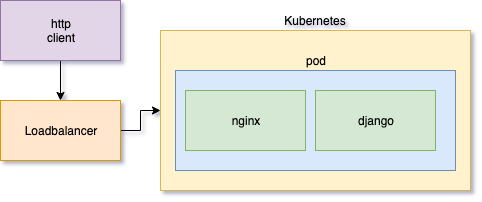

# Welcome to Docker Service Example

## Overview

This is an overview of my service; I wrote this service to fullfill a use-case as requested by a stakeholder.  It performs these duties, allowing end users to perform their job function.  It currently runs as a service on some infrastructure.  Please let me know at my-email-address if you require any support.

This documentation is sorted into the following sections:

* Getting Started
* Architecture
* API Reference
* Testing
* About

Below you will find overviews for each section, and can navigate to the full documentation in the navigation bar.

## Getting Started

This is a standard nginx, django powered service running under Docker containers.  The services are configured via configuration files supplied at build time.  These files can be tuned to enhance functionality, and free resources.  As a starter, clone this repository and tweak the settings to your desire.  The configuration file supplied looks like this:

```yaml
debug: true
fun-factor: enhanced
maintainers: ['john.doe@fakeorg.com', 'jane.doe@fakeorg.com']
```

Once ready, run the included build script and magic will take care of the rest.

## Architecture

This service is composed of several micro-services.  Each micro-service uses industry standards so that I, as an Engineer can spend more time working with stakeholders to help them achieve their true purpose instead of spending time re-implementing certain services, features, etc.

These services currently consist of:

* nginx
* django

As these services are industry standards, there are large teams that support them.



## API

The following RESTful API endpoints are available:

| Method | EndPoint | Description                                    |
|------|---------|---------------------------------------------------|
| GET  | /       | Returns index of all commands                     |
| POST | /create | Creates a new entry, requires content, returns id |
| POST | /delete | Deletes an entry, required id                     |
| POST | /modify | Modifies an entry, requires id and content        |

## ChangeLog

### Version 0.0.2

#### Features

* Completed OKR implementation

#### Bug Fixes

* Reads in JSON manifests again
* Added another fix for that thing

## Support

Please file a support ticket if you require any new features, encounter any issues, or would like to say hi.